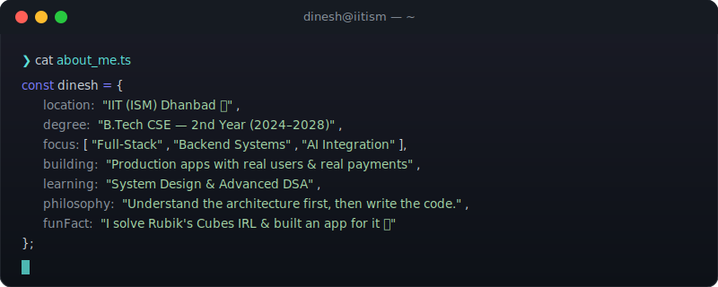

<!-- ══════════════════════════════════════════════════════════════════════════════ -->
<!--                  YETURI DINESH KRISHNA · GITHUB PROFILE README               -->
<!-- ══════════════════════════════════════════════════════════════════════════════ -->

<!-- HEADER WAVE -->


<br/>

<!-- ════════ ANIMATED BORDER HEADER BANNER ════════ -->
<div align="center">
  
</div>

<br/>

<!-- ════════ TYPING TAGLINE ════════ -->
<div align="center">
  
</div>

<br/>

<!-- ════════ SOCIAL BADGES ════════ -->
<div align="center">

[](https://portfolio-lemon-sigma-ttzklk8yxq.vercel.app/)&nbsp;&nbsp;
[](https://www.linkedin.com/in/dineshydk/)&nbsp;&nbsp;
[](https://www.codechef.com/users/dinesh_ydk)&nbsp;&nbsp;
[](mailto:dineshkrishnayeturi@gmail.com)

</div>

<br/>

---

<!-- ════════ TERMINAL WHOAMI ════════ -->
<div align="center">
  <br/>
  <samp>── &nbsp; ABOUT ME &nbsp; ──</samp>
  <br/><br/>
  
  <br/><br/>
</div>

---

<!-- ════════ FEATURED PROJECTS ════════ -->
<div align="center">
  <br/>
  <samp>── &nbsp; FEATURED PROJECTS &nbsp; ──</samp>
  <br/><br/>
</div>

<table width="100%">
<tr>

<td width="50%" valign="top">

<h3 align="center">🧊 Rubik's Cube Solver</h3>
<p align="center"><samp>Cross-platform solver with CV &amp; 3D visualization</samp></p>

<p align="center">
  
  
  
  
</p>

<pre>
🎯 Kociemba Algorithm  →  100% accuracy, &lt;20 moves
📷 OpenCV Pipeline     →  4-phase color detection
🎮 Three.js Engine     →  60fps 3D animations
💾 Express Backend     →  Solve history + sync
</pre>

<p align="center">
  <a href="https://github.com/DINESHYDK/rubiks-cube-solver">
    
  </a>
</p>

</td>

<td width="50%" valign="top">

<h3 align="center">🤖 IntelliDesk AI</h3>
<p align="center"><samp>AI customer support — emails to tickets, automated</samp></p>

<p align="center">
  
  
  
  
</p>

<pre>
🧠 9-step AI Pipeline  →  classify, route, respond
🔍 Vector Search       →  3072-dim, 0.85 threshold
📊 SLA Engine          →  P1–P4 breach detection
📬 IMAP Ingestion      →  50 emails/batch
</pre>

<p align="center">
  <a href="https://github.com/DINESHYDK/IntelliDesk-AI">
    
  </a>&nbsp;
  <a href="https://intellidesk-ten.vercel.app">
    
  </a>
</p>

</td>
</tr>
<tr>

<td width="50%" valign="top">

<h3 align="center">🏥 Medical Copilot</h3>
<p align="center"><samp>Automated lab validation with clinical alerts</samp></p>

<p align="center">
  
  
  
  
</p>

<pre>
🗃️  8-table Schema      →  normalized with triggers
⚡  PL/pgSQL Functions  →  dynamic reference ranges
🔗  5-table JOIN VIEW   →  severity-graded alerts
🖥️  Dual Dashboards     →  Patient &amp; Doctor views
</pre>

<p align="center">
  <a href="https://github.com/DINESHYDK/medical-copilot-frontend">
    
  </a>&nbsp;
  <a href="https://module45-dbms-ism.streamlit.app/">
    
  </a>
</p>

</td>

<td width="50%" valign="top">

<h3 align="center">⛳ GolfGive</h3>
<p align="center"><samp>Play golf, win prizes, change lives</samp></p>

<p align="center">
  
  
  
  
</p>

<pre>
💳 Stripe Integration  →  subscription management
🎯 Score Tracking      →  Stableford monthly draws
❤️  Charity Engine     →  10%+ auto-allocation
📱 Production App      →  deployed, real users
</pre>

<p align="center">
  <a href="https://golf-charity-digitalheroes.vercel.app/">
    
  </a>
</p>

</td>
</tr>
</table>

<br/>

---

<!-- ════════ TECH ARSENAL ════════ -->
<div align="center">
  <br/>
  <samp>── &nbsp; TECH ARSENAL &nbsp; ──</samp>
  <br/><br/>
</div>

<div align="center">

| &nbsp;&nbsp;&nbsp;&nbsp;&nbsp;&nbsp;&nbsp;&nbsp;&nbsp;&nbsp; | Stack |
|:---:|:---|
| <samp>**LANGUAGES**</samp> |       |
| <samp>**FRONTEND**</samp> |      |
| <samp>**BACKEND**</samp> |     |
| <samp>**DATABASES**</samp> |      |
| <samp>**AI & VISION**</samp> |    |
| <samp>**DEVOPS**</samp> |     |

</div>

<br/>

---

<!-- ════════ GITHUB ANALYTICS ════════ -->
<div align="center">
  <br/>
  <samp>── &nbsp; GITHUB ANALYTICS &nbsp; ──</samp>
  <br/><br/>
</div>

<div align="center">
  
  &nbsp;&nbsp;
  
</div>

<div align="center">
  <br/>
  
</div>

<br/>

---

<!-- ════════ COMPETITIVE PROGRAMMING ════════ -->
<div align="center">
  <br/>
  <samp>── &nbsp; COMPETITIVE PROGRAMMING &nbsp; ──</samp>
  <br/><br/>
</div>

<div align="center">

```text
  ╔══════════════════╦═══════════════════════╦══════════════════════════════════════════════╗
  ║  Platform        ║  Rating               ║  Highlights                                 ║
  ╠══════════════════╬═══════════════════════╬══════════════════════════════════════════════╣
  ║  CodeChef        ║  ★★★  1652            ║  1500+ solved  ·  Diamond Streak            ║
  ║  Codeforces      ║  Pupil  1254          ║  Targeting Expert rating                    ║
  ║  LeetCode        ║  80+ solved           ║  Pattern-focused interview prep             ║
  ╚══════════════════╩═══════════════════════╩══════════════════════════════════════════════╝
```

<samp>🏅 <b>AlgoUniversity Tech Fellowship 2025</b> — Top 8% Nationwide &nbsp;·&nbsp; 🎓 <b>Google Student Upskilling</b> — Advanced DSA</samp>

</div>

<br/>

---

<!-- ════════ CURRENT STATUS ════════ -->
<div align="center">
  <br/>
  <samp>── &nbsp; CURRENT STATUS &nbsp; ──</samp>
  <br/><br/>
</div>

```text
  🔨  Building    →  Production apps with real users & real payments
  📚  Learning    →  System Design · Advanced DSA · Docker & CI/CD
  🎓  Studying    →  B.Tech CSE @ IIT ISM Dhanbad (4th Semester)
  🏆  Competing   →  Pushing CodeChef & Codeforces ratings daily
  🔍  Looking for →  Summer 2026 Full-Stack Development Internship
```

<br/>

---

<!-- ════════ TROPHIES ════════ -->
<div align="center">
  <br/>
  <samp>── &nbsp; TROPHIES &nbsp; ──</samp>
  <br/><br/>
  
</div>

<br/>

---

<!-- ════════ CONTRIBUTION GRAPH ════════ -->
<div align="center">
  <br/>
  <samp>── &nbsp; CONTRIBUTION GRAPH &nbsp; ──</samp>
  <br/><br/>
  
</div>

<!-- SNAKE ANIMATION -->
<div align="center">
  <br/>
  
  <br/>
</div>

<br/>

---

<!-- ════════ CHALLENGE ZONE ════════ -->
<div align="center">
  <br/>
  <samp>── &nbsp; 🧩 CHALLENGE ZONE &nbsp; ──</samp>
  <br/>
  <samp>Think you know your stuff? Try these.</samp>
  <br/><br/>
</div>

<details>
<summary>&nbsp; 🧊 &nbsp;<b>Rubik's Challenge:</b> &nbsp; A standard 3×3 Rubik's Cube has how many possible permutations? &nbsp;<samp>(click to reveal)</samp></summary>
<br/>

```text
  ╔══════════════════════════════════════════════════════════════════════════════╗
  ║                                                                            ║
  ║   43,252,003,274,489,856,000                                               ║
  ║                                                                            ║
  ║   That's ~43.25 quintillion states.                                        ║
  ║   Yet God's Number is just 20 — any state solved in 20 moves or fewer.    ║
  ║   My solver uses the Kociemba Two-Phase Algorithm to get there in <100ms.  ║
  ║                                                                            ║
  ╚══════════════════════════════════════════════════════════════════════════════╝
```

</details>

<details>
<summary>&nbsp; 🧠 &nbsp;<b>Code Challenge:</b> &nbsp; What does this print? &nbsp;<samp>(click to reveal)</samp></summary>
<br/>

```javascript
const arr = [1, 2, 3, 4, 5];
const result = arr.reduce((acc, val) => {
  return val % 2 === 0 ? acc * val : acc + val;
}, 0);
console.log(result);
```

```text
  ╔══════════════════════════════════════════════════════════════════════════════╗
  ║                                                                            ║
  ║   ✅ Answer: 25                                                            ║
  ║                                                                            ║
  ║   0 + 1 (odd)  = 1   →   1 × 2 (even) = 2   →   2 + 3 (odd)  = 5        ║
  ║   5 × 4 (even) = 20  →   20 + 5 (odd) = 25                               ║
  ║                                                                            ║
  ║   The trick: reduce starts at 0, not arr[0].                              ║
  ║   If you got 72, you forgot the initial accumulator.                      ║
  ║                                                                            ║
  ╚══════════════════════════════════════════════════════════════════════════════╝
```

</details>

<details>
<summary>&nbsp; ⚡ &nbsp;<b>System Design:</b> &nbsp; You're building a chat app. WebSockets or Long Polling? &nbsp;<samp>(click to reveal)</samp></summary>
<br/>

```text
  ╔══════════════════════════════════════════════════════════════════════════════╗
  ║  WebSockets — and here's why:                                              ║
  ║                                                                            ║
  ║  Long Polling:  Client → Server → Wait → Response → Reconnect             ║
  ║                 New HTTP connection per cycle · Latency: 50–200ms          ║
  ║                                                                            ║
  ║  WebSockets:    Client ↔ Server  (persistent TCP)                         ║
  ║                 Single handshake, lightweight frames · Latency: <10ms     ║
  ║                                                                            ║
  ║  For real-time chat you need:                                             ║
  ║  ✓ Bi-directional   ✓ Low latency   ✓ Server push                        ║
  ║                                                                            ║
  ║  I used Socket.io + Redis pub/sub in my projects for exactly this.        ║
  ╚══════════════════════════════════════════════════════════════════════════════╝
```

</details>

<details>
<summary>&nbsp; 🗃️ &nbsp;<b>DB Challenge:</b> &nbsp; When would you pick PostgreSQL over MongoDB? &nbsp;<samp>(click to reveal)</samp></summary>
<br/>

```text
  ╔══════════════════════════════════════════════════════════════════════════════╗
  ║  PostgreSQL when:                           MongoDB when:                  ║
  ║  → Complex relationships & joins            → Schema evolves rapidly       ║
  ║  → ACID compliance is non-negotiable        → Nested/hierarchical data     ║
  ║  → Triggers, stored procs, views            → Horizontal scaling priority  ║
  ║  → Data integrity > schema flexibility      → Read-heavy + denormalized    ║
  ║                                                                            ║
  ║  In my projects:                                                           ║
  ║  •  Medical Copilot  →  PostgreSQL   (8 related tables, triggers)         ║
  ║  •  Rubik's Solver   →  MongoDB      (flexible solve history docs)        ║
  ║  •  IntelliDesk      →  Supabase/PG  (SLA workflows need ACID)           ║
  ╚══════════════════════════════════════════════════════════════════════════════╝
```

</details>

<br/>

---

<!-- ════════ FOOTER ════════ -->
<div align="center">
  <br/>
  <samp>Open to collaborations, open-source contributions, and internship opportunities.</samp>
  <br/><br/>

  *"First, solve the problem. Then, write the code."*

  <br/><br/>

  

  <br/><br/>
</div>

<!-- FOOTER WAVE -->

